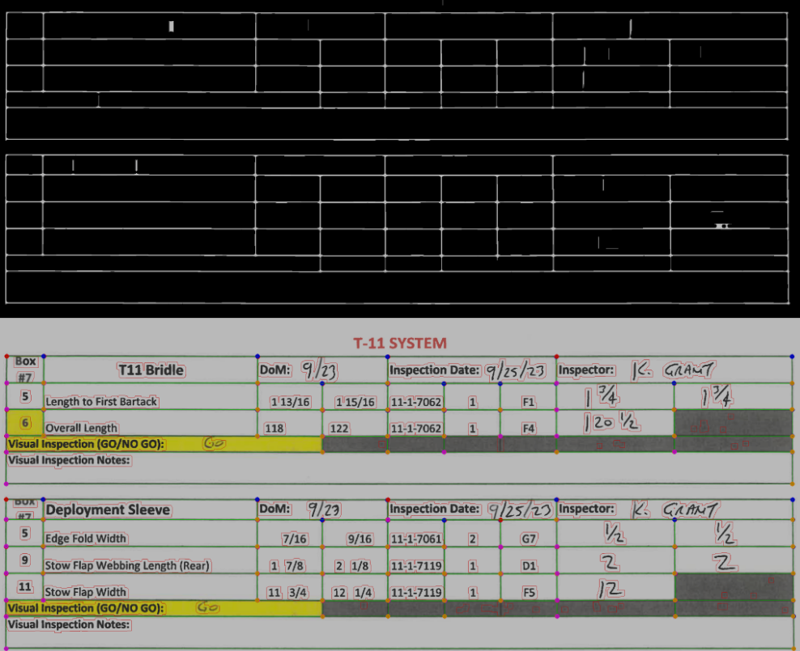

<!-- Improved compatibility of back to top link: See: https://github.com/othneildrew/Best-README-Template/pull/73 -->

<!--
*** Thanks for checking out the Best-README-Template. If you have a suggestion
*** that would make this better, please fork the repo and create a pull request
*** or simply open an issue with the tag "enhancement".
*** Don't forget to give the project a star!
*** Thanks again! Now go create something AMAZING! :D
-->

<!-- PROJECT SHIELDS -->
<!--
*** I'm using markdown "reference style" links for readability.
*** Reference links are enclosed in brackets [ ] instead of parentheses ( ).
*** See the bottom of this document for the declaration of the reference variables
*** for contributors-url, forks-url, etc. This is an optional, concise syntax you may use.
*** https://www.markdownguide.org/basic-syntax/#reference-style-links
-->
[![Contributors][contributors-shield]][contributors-url]
[![Forks][forks-shield]][forks-url]
[![Stargazers][stars-shield]][stars-url]
[![Issues][issues-shield]][issues-url]
[![MIT License][license-shield]][license-url]

<!-- PROJECT LOGO -->
 

  

  <h3 align="center">
    Machine Learning, Image Processing,
    and Transfer Learning for
    Handwritten Spreadsheet Digitization
  </h3>

  

    A Major Qualifying Project (MQP) Report
    Submitted to the Faculty of
    WORCESTER POLYTECHNIC INSTITUTE
    in partial fulfillment of the requirements
    for the Degree of Bachelor of Science in
    Computer Science,
    Data Science,
    and Mathematical Sciences.
     
    <a href="https://github.com/Handwriting-MQP/Parachute-Converter"><strong>Explore the docs »</strong></a>
     
     
    <!--<a href="https://github.com/Handwriting-MQP/Parachute-Converter">View Demo</a>
    ·
    <a href="https://github.com/Handwriting-MQP/Parachute-Convertere/issues">Report Bug</a>
    ·
    <a href="https://github.com/Handwriting-MQP/Parachute-Converter/issues">Request Feature</a>!-->
  

<!-- TABLE OF CONTENTS -->

  
Table of Contents

  <ol>
    <li>
      <a href="#about-the-project">About The Project</a>
      <ul>
        <li><a href="#built-with">Built With</a></li>
      </ul>
    </li>
    <li>
      <a href="#getting-started">Getting Started</a>
      <ul>
        <li><a href="#prerequisites">Prerequisites</a></li>
        <li><a href="#installation">Installation</a></li>
      </ul>
    </li>
    <li><a href="#usage">Usage</a></li>
    <li><a href="#project-structure">Project Structure</a></li>
    <li><a href="#license">License</a></li>
    <li><a href="#contact">Contact</a></li>
    <li><a href="#acknowledgments">Acknowledgments</a></li>
  </ol>

<!-- ABOUT THE PROJECT -->
## About The Project
<!--[![Product Name Screen Shot][product-screenshot]](https://example.com)-->

This report details the development of a software program aimed at converting handwritten parachute data records from the Natick Army Lab into an analyzable digital format. Due to the failure of traditional OCR models to recognize handwritten fractions, a crucial part of the data, we generated a synthetic dataset to specifically fine-tune these models. The software utilizes image processing and OCR technologies to translate text and replicate the physical document's layout in a digital format. This innovation streamlines data analysis, enhancing the Army's ability to monitor and understand parachute integrity and lifecycle.

(<a href="#readme-top">back to top</a>)

### Built With

* 
* 
* 
* 
* 

(<a href="#readme-top">back to top</a>)

<!-- GETTING STARTED -->
## Getting Started
### Prerequisites
1. Converting Images to Excel:
   1. Download the "Models" folder from OneDrive [here](https://wpi0-my.sharepoint.com/:f:/g/personal/eltrilling_wpi_edu/ElXqwztGnt1In2gNbu6Cf54Bohex30jY_KiDKKS_BYYHrA?e=u1bkQK) and place it in the project root
2. Training Cell Classifier Model:
   1. download "words.zip" from OneDrive [here](https://wpi0-my.sharepoint.com/:f:/g/personal/eltrilling_wpi_edu/ElXqwztGnt1In2gNbu6Cf54Bohex30jY_KiDKKS_BYYHrA?e=u1bkQK)
   2. unzip it to "./TrainCellClassifierModel/IAM-data/words"

### Installation
1. Install Cuda 12.1 on machine if using an NVIDIA GPU
   - Guide to do so can be found here: https://docs.nvidia.com/cuda/cuda-installation-guide-microsoft-windows/
2. After creating a virtual environment use ``pip install -r requirements.txt``

(<a href="#readme-top">back to top</a>)

<!-- USAGE EXAMPLES -->
## Primary File Functions

* ``PreprocessImages.py``: Resize raw images to proper format
* ``DewarpPerspective.py``: Dewarp any skewed images
* ``GenerateSyntheticMixedNumberData.py``: Generate the images for the Synthetic Fraction Dataset
* ``GenerateCellClassifieerData.py``: Generate the images for the various Cell Classification Types

## Main Script Pipeline
1. run SplitPDFsIntoImages.py to break a PDF up into image files
2. run PreprocessImages.py to do a basic rotation deskew and resize the images
3. run WarpPerspectiveDeskew.py to do a perspective deskew on the images
4. run ConvertImagesToXLSX to do OCR on the images
    - first it finds cell edges
    - then it does OCR on each cell
5. run ``pyinstaller DatasheetDigitizationPipelineGUI.py`` to convert the project to an executable
   - a fille called "DatasheetDigitizationPipelineGUI.exe" will be saved under "./dist/HandwritingRecognitionPipelineGUI/"

<!--_For more examples, please refer to the [Documentation](https://example.com)_-->

(<a href="#readme-top">back to top</a>)

<!-- LICENSE -->
## License

N/A

(<a href="#readme-top">back to top</a>)

<!-- CONTACT -->
## Contact

By:
* Matthew Haley - mahaley@wpi.edu
* Liam Hall - llhall@wpi.edu
* Christopher Langevin - ctlangevin@wpi.edu
* Cameron Norton - cjnorton@wpi.edu
* Harsh Patel - hmpatel@wpi.edu
* Elliot Trilling - eltrilling@wpi.edu

Project Advisors:
* Professor Oren Mangoubi - omangoubi@wpi.edu
* Professor Randy Paffenroth - rcpaffenroth@wpi.edu

Sponsored By:
* Professor Gregory Noetscher - gregn@wpi.edu

(<a href="#readme-top">back to top</a>)

<!-- ACKNOWLEDGMENTS -->
## Acknowledgments

Our project would not have been possible without the help of our sponsors and advisors. We would like to thank Dr. Greg Noetscher for his guidance in helping us understanding the requirements of this project. We are grateful to Natick Army Research Labs for allowing us to work on an impactful project. We would also like to thank our advisors, Professor Oren Mangoubi and Professor Randy Paffenroth. Both advisors shared their expertise in Math, Data Science, and Computer Science. Lastly, we appreciate the departments of Mathematical Sciences and Computer Science at Worcester Polytechnic Institute for providing the educational foundation that prepared us for this project through a diverse range of classes and coursework during our undergraduate studies.

(<a href="#readme-top">back to top</a>)

<!-- MARKDOWN LINKS & IMAGES -->
<!-- https://www.markdownguide.org/basic-syntax/#reference-style-links -->
[contributors-shield]: https://img.shields.io/github/contributors/Handwriting-MQP/Parachute-Converter.svg?style=for-the-badge
[contributors-url]: https://github.com/Handwriting-MQP/Parachute-Converter/graphs/contributors
[forks-shield]: https://img.shields.io/github/forks/Handwriting-MQP/Parachute-Converter.svg?style=for-the-badge
[forks-url]: https://github.com/Handwriting-MQP/Parachute-Converter/network/members
[stars-shield]: https://img.shields.io/github/stars/Handwriting-MQP/Parachute-Converter.svg?style=for-the-badge
[stars-url]: https://github.com/Handwriting-MQP/Parachute-Converter/stargazers
[issues-shield]: https://img.shields.io/github/issues/Handwriting-MQP/Parachute-Converter.svg?style=for-the-badge
[issues-url]: https://github.com/Handwriting-MQP/Parachute-Converter/issues
[license-shield]: https://img.shields.io/github/license/Handwriting-MQP/Parachute-Converter.svg?style=for-the-badge
[license-url]: https://github.com/Handwriting-MQP/Parachute-Converter/blob/master/LICENSE.txt
[linkedin-shield]: https://img.shields.io/badge/-LinkedIn-black.svg?style=for-the-badge&logo=linkedin&colorB=555
[linkedin-url]: https://linkedin.com/in/hmpatel1350

